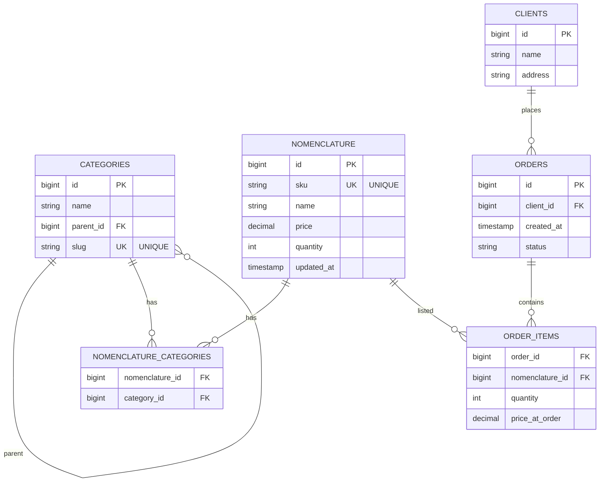

# IT Guru Test Assignment Overview

Этот репозиторий структурирован по заданиям:
- `1.design_db` — проектирование схемы БД и обоснование архитектурных решений.
- `2.write_sql_queries` — примерные SQL‑запросы к спроектированной схеме (аналитика и оптимизация).
- `3.order_service` — сервис добавления товара в заказ (REST API).

> Ниже приведена концептуальная ER‑диаграмма (Mermaid) текущей модели данных, отражающей результаты задания 1.

## ER Diagram

## Ссылки на задания
| Задание | Описание | Путь |
|--------|----------|------|
| 1 | Проектирование схемы БД | ./1.design_db/README.md |
| 2 | SQL запросы и аналитика | ./2.write_sql_queries/README.md |
| 3 | REST сервис добавления товара в заказ | ./3.order_service/README.md |

(При необходимости в итоговом публичном репозитории можно заменить относительные пути на абсолютные GitHub URLs.)

## Краткое описание решений
- Дерево категорий: adjacency list (`parent_id`) + `slug` для глобальной адресации.
- M:N товары ↔ категории через `nomenclature_categories`.
- M:N заказы ↔ товары через `order_items` (association object с атрибутами `quantity`, `price_at_order`).
- Уникальные бизнес-ключи: `sku`, `slug`.

## Дальнейшие шаги
- Расширение модели категорий (closure table / материализованный путь) для ускорения глубоких выборок.
- Предагрегация метрик продаж (ежедневные/часовые таблицы) для ускорения топов.
- Реализация и документация API (задание 3).

---
Version: 1.0 (Overview)
